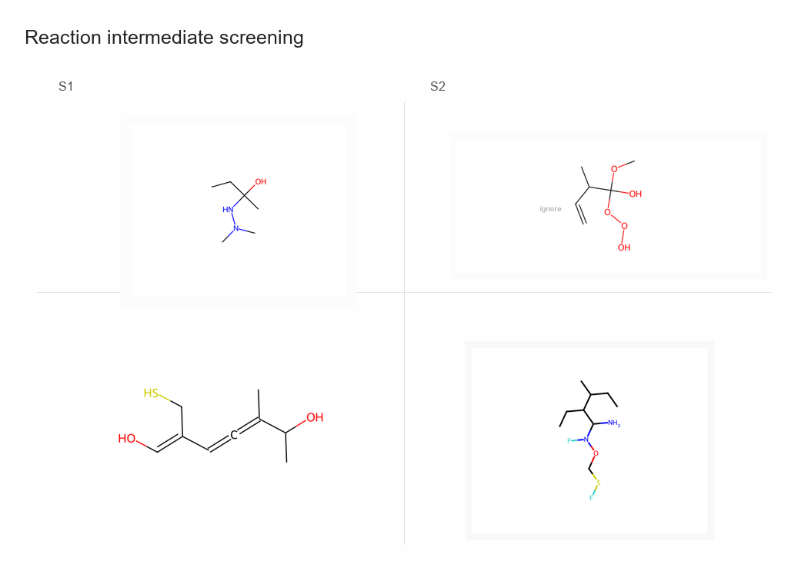
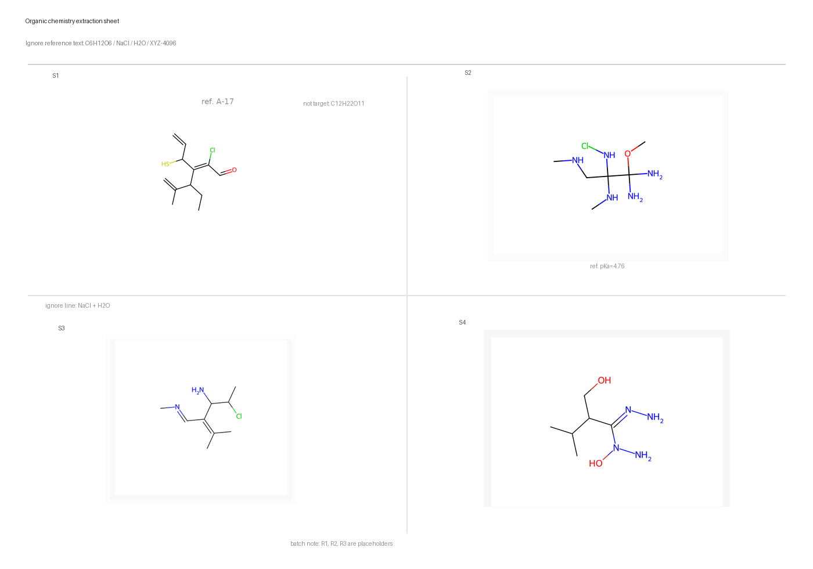

# PaddleOCR-VL-1.5 Organic Formula Recognition LoRA

LoRA adapter and supporting scripts for recognizing organic chemical structure images with PaddleOCR-VL-1.5. The model outputs structured JSON with molecular formulas, elemental counts, and page-level `blocks`.


## Highlights

- Organic chemical structure recognition based on PaddleOCR-VL-1.5.
- Supports single-structure images and multi-structure pages.
- Outputs parseable JSON with `formula`, `elemental_counts`, and `blocks`.
- Includes the LoRA adapter, training configs, inference scripts, evaluation scripts, test samples, and visual examples.

## Evaluation Metrics

The repository reports two evaluation sets separately.

Regular curated set `regular_curated_90`:

| Metric | Value |
|---|---:|
| Samples | 90 |
| Exact accuracy | **78.89%** |
| Set accuracy | **78.89%** |
| Counts accuracy | **78.89%** |
| Block count accuracy | **100.00%** |
| Formula item F1 | **88.24%** |

Hard multi-structure probe set `hard_multistructure_probe_30`:

| Metric | Value |
|---|---:|
| Samples | 30 |
| Exact accuracy | **13.33%** |
| Set accuracy | **13.33%** |
| Counts accuracy | **13.33%** |
| Block count accuracy | **100.00%** |
| Formula item F1 | **67.50%** |

Combined evaluation `curated_combined_120`:

| Metric | Value |
|---|---:|
| Samples | 120 |
| Exact accuracy | **62.50%** |
| Set accuracy | **62.50%** |
| Counts accuracy | **62.50%** |
| Block count accuracy | **100.00%** |
| Formula item F1 | **79.66%** |

Result files:

```text
eval/regular_curated_90.json
eval/hard_multistructure_probe_30.json
eval/curated_combined_120.json
```

An included 100-sample test split is available in `test_data/` for quick local verification. Its packaged evaluation result is `eval/test_100_round7_eval.json`.

## Visual Examples

### Single Structure


| Target formula | Model output | Result |
|---|---|---|
| `C6H11BrO2` | `C6H11BrO2` | Exact match |

### Long-Chain Structure


| Target formula | Model output | Result |
|---|---|---|
| `C16H32O2` | `C16H32O2` | Exact match |

### Two-Structure Page


| Block | Target formula | Model output |
|---:|---|---|
| 1 | `C14H20O` | `C14H20O` |
| 2 | `C10H15NS` | `C10H15NS` |

### Three-Structure Page



| Block | Target formula | Model output |
|---:|---|---|
| 1 | `C13H20O2` | `C13H20O2` |
| 2 | `C10H14BrN` | `C10H14BrN` |
| 3 | `C10H20OS` | `C10H20OS` |

### Four-Structure Page


| Block | Target formula | Model output |
|---:|---|---|
| 1 | `C4H9ClO2S` | `C4H9ClO2S` |
| 2 | `C5H9NS` | `C5H9NS` |
| 3 | `C10H18ClNO3` | `C10H18ClNO3` |
| 4 | `C11H25NO2` | `C11H25NO2` |

### Complex Layout Page



The complex layout example shows page-level `blocks` output on a multi-structure chemical page.

## Output Format

```json
{
  "blocks": [
    {
      "formula": "C16H32O2",
      "elemental_counts": {
        "C": 16,
        "H": 32,
        "O": 2
      }
    }
  ]
}
```

## Repository Structure

```text
adapter/          LoRA adapter files
configs/          PaddleFormers training configs
scripts/          inference, evaluation, and training helper scripts
examples/         visual demo images
eval/             evaluation JSON files
test_data/        100 labeled test samples with images
docs/             technical documents
```

## Quick Start

Install dependencies in a PaddleOCR-VL / PaddleFormers environment:

```bash
pip install -r requirements.txt
```

Prepare the PaddleOCR-VL-1.5 base model separately, then run inference:

```bash
python scripts/run_paddleocr_vl_paddle_infer.py \
  --model-path /path/to/PaddleOCR-VL-1.5 \
  --lora-path adapter \
  --image examples/demo_four_structures.png \
  --output result.json \
  --tasks chemical \
  --max-new-tokens 768
```

Evaluate the included 100-sample test set:

```bash
python scripts/evaluate_lora_formula_samples.py \
  --model-path /path/to/PaddleOCR-VL-1.5 \
  --lora-path adapter \
  --jsonl test_data/test_100.jsonl \
  --dataset-dir test_data \
  --output eval_test_100.json \
  --limit 100 \
  --max-new-tokens 768
```

## Training Method

The project uses PaddleFormers SFT with LoRA. The PaddleOCR-VL-1.5 base model is kept frozen, and only LoRA adapter parameters are trained.

Training tasks include:

| Task | Purpose |
|---|---|
| Single-structure formula recognition | Learn formula extraction from one structure image |
| Multi-structure page recognition | Output multiple chemical blocks from one page |
| Layout-preserving task | Keep the `blocks` schema for page-level structure |
| Hard replay | Reinforce difficult page styles |
| Counting curriculum | Improve `elemental_counts` JSON output |

The packaged adapter is `round7_hard_formula`.

## Documentation

- Showcase document: `docs/technical_showcase_zh.md`
- Handoff notes: `docs/handoff_notes_zh.md`
- Model card: `MODEL_CARD.md`

## License

This project is released under the Apache License 2.0. The PaddleOCR-VL-1.5 base model is not included; please follow the base model license separately.
