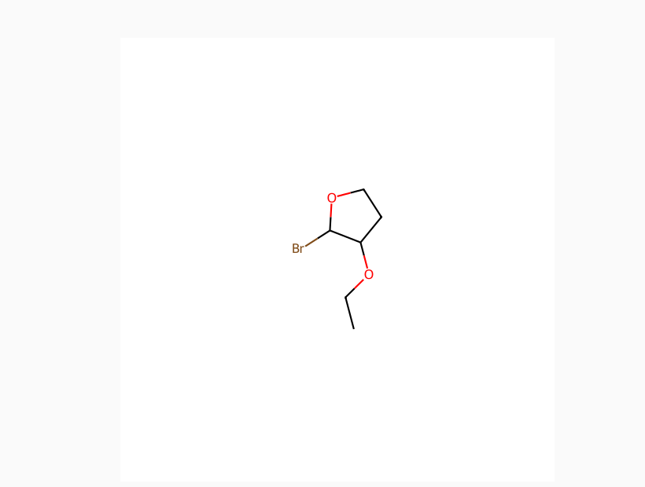
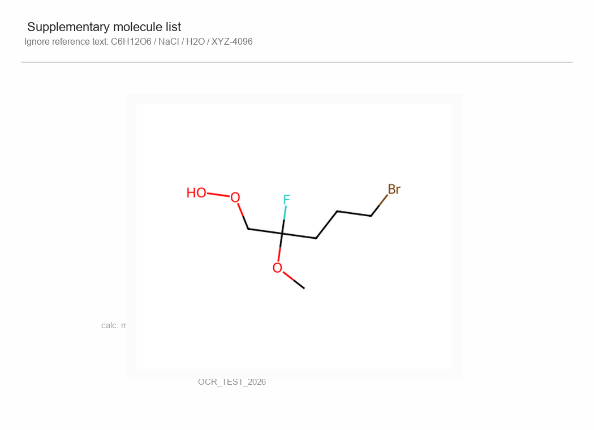
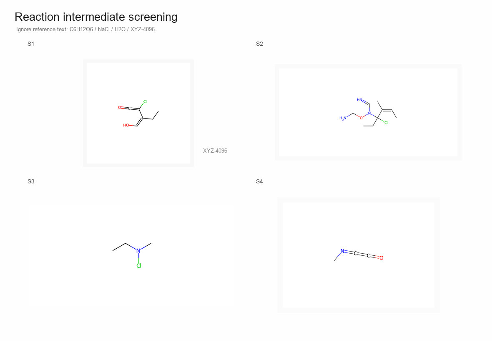
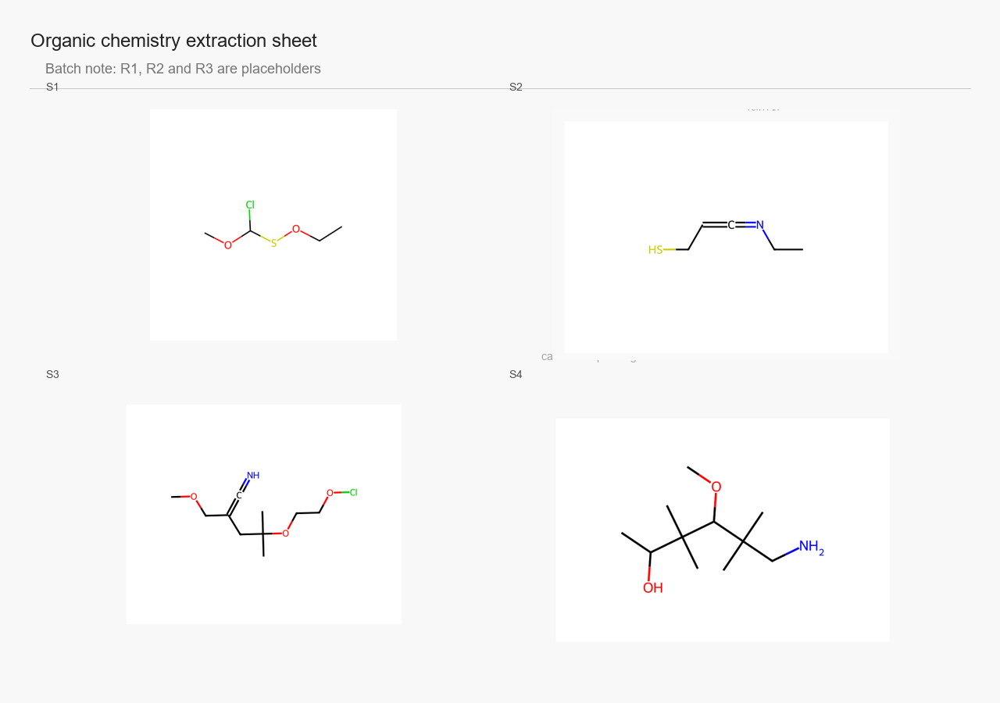

# PaddleOCR-VL-1.5 有机化学结构识别增强成果说明

## 一、项目定位

本项目面向有机化学结构图识别场景，对 PaddleOCR-VL-1.5 进行了专项能力增强。模型不是只做普通 OCR 文本识别，而是从化学结构图中直接抽取结构化结果，包括分子式、元素组成和页面结构块列表。

项目已经完成 LoRA 微调、推理验证、指标评测和工程交付，可作为化学题图解析、实验记录整理、论文图表信息抽取、教材图片结构化处理等任务的基础能力模块。

## 二、整体方案

项目采用 PaddleOCR-VL-1.5 作为多模态基座模型，基于 PaddleFormers 官方训练流程进行 LoRA 微调。整体方案分为四个环节：

1. **训练格式转换**：将图像与标注转换为 PaddleOCR-VL 可训练的 messages/SFT 数据格式。
2. **任务混合训练**：构建单结构识别、多结构页面识别、布局保持、公式抽取和计数增强等任务。
3. **LoRA 轻量微调**：在多卡环境下完成 LoRA 训练，支持 bf16、梯度累积、sharding stage1 与 checkpoint 保存。
4. **自动化评测与交付**：通过固定脚本输出结构化指标，并整理 LoRA adapter、训练配置、评测结果和技术文档。

## 三、训练方法

本项目采用“基座模型 + LoRA adapter”的轻量微调方式。PaddleOCR-VL-1.5 基座模型保持不变，训练过程只更新 LoRA 低秩适配参数，从而降低显存占用和训练成本，也方便在不同任务版本之间快速切换。

训练数据统一组织为 PaddleOCR-VL 可读取的 SFT messages 格式。每条样本由一张化学结构图、一个任务指令和一个标准 JSON 答案组成，模型学习从图像直接生成结构化结果：

```text
image + instruction -> {"blocks": [{"formula": "...", "elemental_counts": {...}}]}
```

训练阶段采用了多任务混合策略：

| 训练任务 | 目标 |
|---|---|
| 单结构公式识别 | 学习从单个有机结构图抽取分子式 |
| 多结构页面识别 | 学习在一页图片中输出多个结构块 |
| layout 保持任务 | 保持 `blocks` 结构，增强页面级结构组织能力 |
| hard replay 难例重放 | 强化复杂页面样式 |
| counting curriculum | 强化元素计数和 `elemental_counts` JSON 输出 |

实际训练使用 PaddleFormers 官方 PaddleOCR-VL 微调流程，配置包含 LoRA rank、学习率、batch size、梯度累积、bf16、sharding stage1、checkpoint 保存与验证集评估。最终交付版本为 `round7_hard_formula`。

## 四、模型输出能力

模型输出采用统一 JSON，便于后端系统直接消费。

### 单结构输出

```json
{
  "blocks": [
    {
      "formula": "C16H32O2",
      "elemental_counts": {
        "C": 16,
        "H": 32,
        "O": 2
      }
    }
  ]
}
```

### 多结构页面输出

```json
{
  "blocks": [
    {
      "formula": "C4H9ClO2S",
      "elemental_counts": {
        "C": 4,
        "H": 9,
        "O": 2,
        "S": 1,
        "Cl": 1
      }
    },
    {
      "formula": "C5H9NS",
      "elemental_counts": {
        "C": 5,
        "H": 9,
        "N": 1,
        "S": 1
      }
    }
  ]
}
```

输出中保留 `blocks` 结构，适合与版面分析、题图裁切、结构块定位、后处理校验等模块衔接。

## 五、评测指标

当前开源仓库采用两个评测集分开记录指标，普通精选集体现常规样本表现，多结构探针集体现复杂页面表现。

| 数据集 | 样本数 | exact / set / counts accuracy | block count accuracy | formula item F1 | 结果文件 |
|---|---:|---:|---:|---:|---|
| 普通精选集 `regular_curated_90` | 90 | **78.89%** | **100.00%** | **88.24%** | `eval/regular_curated_90.json` |
| 多结构探针集 `hard_multistructure_probe_30` | 30 | **13.33%** | **100.00%** | **67.50%** | `eval/hard_multistructure_probe_30.json` |
| 合并评测 `curated_combined_120` | 120 | **62.50%** | **100.00%** | **79.66%** | `eval/curated_combined_120.json` |

`页面结构块数量识别稳定率 100%` 说明模型能够稳定感知一页图片中有多少个化学结构区域；`formula item F1` 用于衡量结构块粒度的分子式抽取效果。

## 六、可视化识别示例

### 示例 1：单结构页面



| 项目 | 内容 |
|---|---|
| 目标分子式 | `C6H11BrO2` |
| 模型输出 | `C6H11BrO2` |
| 结果 | 完全命中 |

### 示例 2：单结构长链分子



| 项目 | 内容 |
|---|---|
| 目标分子式 | `C16H32O2` |
| 模型输出 | `C16H32O2` |
| 结果 | 完全命中 |

### 示例 3：双结构页面



| 结构块 | 目标分子式 | 模型输出 |
|---:|---|---|
| 1 | `C14H20O` | `C14H20O` |
| 2 | `C10H15NS` | `C10H15NS` |

模型能够在同一页面中保持两个结构块的独立输出，并将结果组织到同一个 `blocks` 数组中。

### 示例 4：三结构页面


| 结构块 | 目标分子式 | 模型输出 |
|---:|---|---|
| 1 | `C13H20O2` | `C13H20O2` |
| 2 | `C10H14BrN` | `C10H14BrN` |
| 3 | `C10H20OS` | `C10H20OS` |

### 示例 5：四结构页面



| 结构块 | 目标分子式 | 模型输出 |
|---:|---|---|
| 1 | `C4H9ClO2S` | `C4H9ClO2S` |
| 2 | `C5H9NS` | `C5H9NS` |
| 3 | `C10H18ClNO3` | `C10H18ClNO3` |
| 4 | `C11H25NO2` | `C11H25NO2` |

这个样例展示了一页包含 4 个结构块时，模型同时完成块数量识别、分子式抽取和结构化 JSON 输出。

### 示例 6：复杂拼接页面


该类图片用于验证模型对复杂页面布局的感知能力。模型会以 `blocks` 为基本单元输出多个化学结构结果，保持页面级结构化结果。

## 七、工程交付内容

交付包已经整理为可复用工程资产：

| 目录/文件 | 内容 |
|---|---|
| `adapter/` | LoRA adapter，可加载到 PaddleOCR-VL-1.5 基座模型 |
| `configs/` | PaddleFormers 训练 YAML 配置 |
| `scripts/` | 推理、评测和训练辅助脚本 |
| `eval/` | 当前评测结果 |
| `examples/` | 可视化识别样例 |
| `test_data/` | 100 条本地验证样本 |
| `docs/assets/` | 展示文档配图样例 |

最佳交付版本：

```text
adapter/
```

该版本来自 `round7_hard_formula`，是当前已整理评测结果中综合表现最好的一版 LoRA adapter。

## 八、应用价值

本项目证明了 PaddleOCR-VL-1.5 可以通过轻量 LoRA 微调快速适配专业化化学结构识别任务。相比传统 OCR 只能识别图片中的文字，该方案能够面向结构图直接输出分子式和元素组成，并用 JSON 保留结构块级结果。
